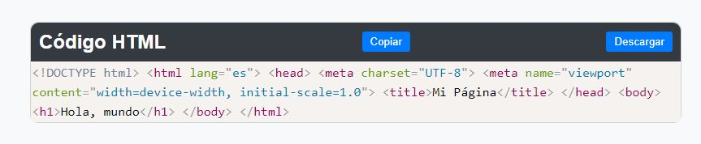

# Visor de Código

## Acceso Rápido a la Aplicación
[VisorHTML](https://xococode.github.io/EditorHTML.github.io/)

## Descripción

Este proyecto es un visor de código HTML interactivo que permite a los usuarios visualizar, copiar y descargar fragmentos de código HTML de manera fácil y eficiente. La interfaz amigable divide la pantalla en una sección para mostrar el código y botones de acciones para copiar, descargar y resaltar la sintaxis utilizando Prism.js.

## Características

- **Visualizador de Código Integrado**: Utiliza Prism.js para resaltar la sintaxis de código HTML, mejorando la legibilidad y estética del código.
- **Botones de Acción**:
  - **Copiar**: Copia el código HTML mostrado al portapapeles.
  - **Descargar**: Descarga el código HTML como un archivo `.html`.
- **Estilos Personalizados**: Diseño responsive y moderno para una mejor experiencia de usuario.
- **Interactividad Mejorada**: Interacciones simples como copiar al portapapeles y descargar archivos con un clic.
- **Compatibilidad Multinavegador**: Funciona correctamente en los navegadores modernos principalmente: Chrome, Firefox, Edge y Safari.

## Descargo de Responsabilidad

**Importante:** El uso de este código es bajo total responsabilidad del usuario. ** Xocostudio** no se hace responsable por ningún tipo de mal uso, daño directo o indirecto, pérdida de datos, o cualquier otro perjuicio que pueda derivarse del uso de este software.

### Sin Garantías

El software se proporciona "tal cual", sin garantías de ningún tipo, ya sean expresas o implícitas. Esto incluye, pero no se limita a, las garantías de comerciabilidad, adecuación para un propósito particular y no infracción.

### Exención de Responsabilidad

Los autores no son responsables por cualquier reclamación, daño u otra responsabilidad que surja del uso del software, ya sea en una acción de contrato, agravio o de otra manera, que surja de, fuera de o en conexión con el software o el uso u otros tratos en el software.

### Uso del Código

Al descargar y utilizar este código, aceptas hacerlo bajo tu propio riesgo. Es tu responsabilidad asegurarte de que el software es adecuado para tus necesidades y de tomar todas las precauciones necesarias para evitar posibles daños o pérdidas.

Si tienes alguna pregunta o necesitas más información, por favor contacta a Xocostudio.

---

*¡Gracias por utilizar nuestro software! Asegúrate de leer y entender este descargo de responsabilidad antes de proceder.*

